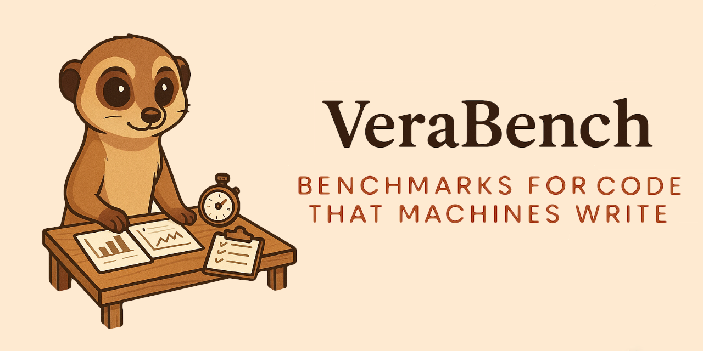

# VeraBench

[](https://veralang.dev)

[](https://github.com/aallan/vera-bench/actions/workflows/ci.yml)
[](https://codecov.io/gh/aallan/vera-bench)

A benchmark for evaluating LLM code generation in [Vera](https://github.com/aallan/vera), a programming language designed for large language models (LLMs) to write.

## Initial Results

First benchmark results from [VeraBench v0.0.4](https://github.com/aallan/vera-bench/releases/tag/v0.0.4) against [Vera v0.0.104](https://github.com/aallan/vera/releases/tag/v0.0.104) using a single run of [Claude Sonnet 4](https://platform.claude.com/docs/en/about-claude/models/overview#claude-4) (`claude-sonnet-4-20250514`) across 50 problems:

| Mode | check@1 | verify@1 | fix@1 | run_correct |
|------|---------|----------|-------|-------------|
| Vera (full-spec) | 94% | 98% | 67% | 83% |
| Vera (spec-from-NL) | 94% | 88% | 33% | 78% |
| Python (LLM) | 100% | - | - | 92% |
| TypeScript (LLM) | 100% | - | - | 79% |
| Python baseline | 100% | - | - | 100% |
| TypeScript baseline | 100% | - | - | 100% |

**Vera with contracts provided outperforms TypeScript without them** — 83% vs 79% run_correct — despite being a novel language with zero presence in training data. Vera's mandatory contracts and typed slot references provide enough guardrails to compensate for the model having never seen the language before.

**Python remains the strongest LLM target** at 92%, which is expected — it's the most represented language in training data. But the gap between Python and Vera (9 points) is remarkably small given that Vera requires De Bruijn indices, mandatory contracts, and explicit effect annotations that the model must learn entirely from the [SKILL.md](https://veralang.dev/SKILL.md) reference provided at evaluation time.

**Writing contracts is harder than writing code.** The spec-from-NL mode (where the model must infer its own contracts from the natural language description) drops verify@1 by 10 points and halves fix@1. The implementation itself barely changes — check@1 holds at 94% — but getting the contracts right from NL alone is the real challenge.

> **Note:** These are single-run results from one model. LLM outputs are non-deterministic — individual problems can flip between pass and fail across runs. Stable rates will require multiple trials ([pass@k](https://arxiv.org/abs/2107.03374) — sample k independent outputs per problem, count as passed if any output succeeds). More models and repeated runs are planned.

## Overview

VeraBench measures whether LLMs write better code in a language designed for them. Vera uses typed slot references instead of variable names, mandatory contracts, and explicit algebraic effects — all features that should make LLM-generated code more verifiable.

The benchmark covers five difficulty tiers:

| Tier | Focus | What it tests |
|------|-------|--------------|
| 1 | Pure arithmetic | Basic syntax, `@T.n` slot references, simple contracts |
| 2 | String & array ops | Built-in function discovery (`domain_verb` naming) |
| 3 | ADTs & match | Data type definition, De Bruijn indices in match arms |
| 4 | Recursion & termination | `decreases` clauses, Z3 verification |
| 5 | Multi-function & effects | IO, State, Exn, effect propagation across functions |

For each problem, we measure:

- **check@1** — Does the code pass `vera check` on first attempt?
- **verify@1** — Does it pass `vera verify` (Z3 contract verification)?
- **fix@1** — Given the error message, can the model fix it in one turn?
- **run_correct** — Does execution produce the correct output?

The same problems are also run in Python and TypeScript as baselines.

## Prerequisites

* Python 3.11+
* Git
* Node.js 22+ *(optional, for TypeScript baselines and generation)*

## Installation

```bash
git clone https://github.com/aallan/vera-bench.git
cd vera-bench
python -m venv .venv
source .venv/bin/activate
pip install -e ".[llm]"
```

The `[llm]` extra installs the Anthropic and OpenAI SDKs. Use `pip install -e .` if you only need validation (no model evaluation).

### Install the Vera compiler

The `vera` command must be available on `$PATH`. Install it anywhere into the same environment, either from a local clone,

```bash
pip install -e /path/to/vera          
```

or directly from GitHub.

```bash
pip install git+https://github.com/aallan/vera.git   
```
Afterwards you should be able to print the Vera version from the terminal,

```bash
vera version   
```

this should return v0.0.104 or later.

## Quick start

Once Vera is installed you can run the benchmark from the terminal,

```bash
# Validate all 50 problems and canonical solutions
vera-bench validate

# Run benchmark against a model
export ANTHROPIC_API_KEY=sk-ant-...
vera-bench run --model claude-sonnet-4-20250514

# Run a single tier
vera-bench run --model claude-sonnet-4-20250514 --tier 1

# Run a single problem
vera-bench run --model claude-sonnet-4-20250514 --problem VB-T1-001

# Spec-from-NL mode (agent writes its own contracts)
vera-bench run --model claude-sonnet-4-20250514 --mode spec-from-nl

# Ask the same model to write Python or TypeScript for comparison
vera-bench run --model claude-sonnet-4-20250514 --language python
vera-bench run --model claude-sonnet-4-20250514 --language typescript

# Run canonical baselines as a reference
vera-bench baselines
vera-bench baselines --language typescript

# Generate a combined report
vera-bench report results/

# Or run the full benchmark suite (all 6 targets) with one command
python scripts/run_full_benchmark.py
```

Supported providers: [Anthropic](https://anthropic.com) (Claude), [OpenAI](https://openai.com) (GPT), and [Moonshot](https://moonshot.cn) (Kimi). Set the appropriate API key environment variable (`ANTHROPIC_API_KEY`, `OPENAI_API_KEY`, or `MOONSHOT_API_KEY`).

The Vera language reference ([SKILL.md](https://veralang.dev/SKILL.md)) is fetched automatically from veralang.dev when running Vera benchmarks. To use a local copy instead (e.g., for testing unreleased language features):

```bash
vera-bench run --model claude-sonnet-4-20250514 --skill-md /path/to/SKILL.md
```

## Results

Running `vera-bench report results/` generates `results/summary.md` with a summary table, per-tier breakdowns, and per-problem detail. Each `vera-bench run` writes incremental JSONL results (one line per problem attempt), so partial runs are resumable and always reportable. Results files are in `.gitignore` — they are generated artifacts, not checked in.

## Prior art

VeraBench is inspired by:

- [HumanEval](https://github.com/openai/human-eval) — 164 Python function completion problems
- [MBPP](https://github.com/google-research/google-research/tree/master/mbpp) — 974 Python problems from natural language
- [DafnyBench](https://github.com/sun-wendy/DafnyBench) — 782 Dafny verification annotation problems

DafnyBench demonstrated that tracking verification success rates over time attracts genuine research attention — success rates went from 68% to 96% across model generations in under two years. VeraBench aims to create the same longitudinal story for a language designed from scratch for LLM code generation.

## Citation

```bibtex
@software{verabench2026,
  author = {Allan, Alasdair},
  title = {VeraBench: a benchmark suite for LLM code generation in Vera},
  year = {2026},
  url = {https://github.com/aallan/vera-bench}
}
```

## License

VeraBench is licensed under the [MIT License](LICENSE).

Copyright © 2026 Alasdair Allan

Permission is hereby granted, free of charge, to any person obtaining a copy of this software and associated documentation files (the "Software"), to deal in the Software without restriction, including without limitation the rights to use, copy, modify, merge, publish, distribute, sublicense, and/or sell copies of the Software, and to permit persons to whom the Software is furnished to do so, subject to the following conditions:

The above copyright notice and this permission notice shall be included in all copies or substantial portions of the Software.

THE SOFTWARE IS PROVIDED "AS IS", WITHOUT WARRANTY OF ANY KIND, EXPRESS OR IMPLIED, INCLUDING BUT NOT LIMITED TO THE WARRANTIES OF MERCHANTABILITY, FITNESS FOR A PARTICULAR PURPOSE AND NONINFRINGEMENT. IN NO EVENT SHALL THE AUTHORS OR COPYRIGHT HOLDERS BE LIABLE FOR ANY CLAIM, DAMAGES OR OTHER LIABILITY, WHETHER IN AN ACTION OF CONTRACT, TORT OR OTHERWISE, ARISING FROM, OUT OF OR IN CONNECTION WITH THE SOFTWARE OR THE USE OR OTHER DEALINGS IN THE SOFTWARE.
